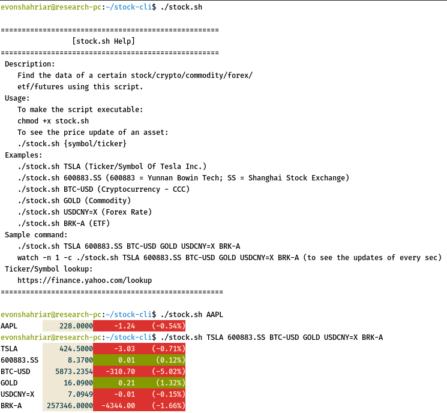

# stock-cli
Find the price data of a certain stock / crypto / commodity / forex / etf / futures using this bash-script.
## Executing the script

## Help

 Usage:
    
    To make the script executable:
    chmod +x stock.sh
    
    To see the price update of an asset:
    ./stock.sh {symbol/ticker}
    
    To make it executable from the terminal every time we login using stock {usage},
    we’ll have to add it to the bash profile in our bin directory.
 
 Examples:
    
    ./stock.sh TSLA (Ticker/Symbol Of Tesla Inc.)
    ./stock.sh 600883.SS (600883 = Yunnan Bowin Tech; SS = Shanghai Stock Exchange)
    ./stock.sh BTC-USD (Cryptocurrency - CCC)
    ./stock.sh GOLD (Commodity)
    ./stock.sh USDCNY=X (Forex Rate)
    ./stock.sh BRK-A (ETF)
 
 Sample commands: 
    
    ./stock.sh TSLA 600883.SS BTC-USD GOLD USDCNY=X BRK-A
    watch -n 1 -c ./stock.sh TSLA 600883.SS BTC-USD GOLD USDCNY=X BRK-A (to see the updates of every sec)
 
 Tinker/Symbol lookup:
   
    https://finance.yahoo.com/lookup

